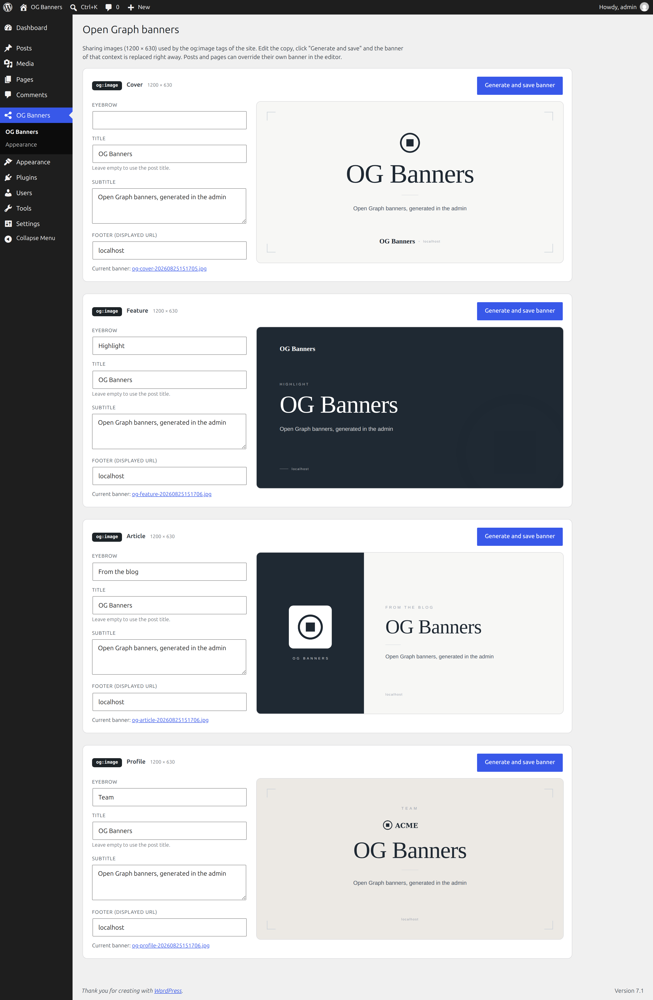
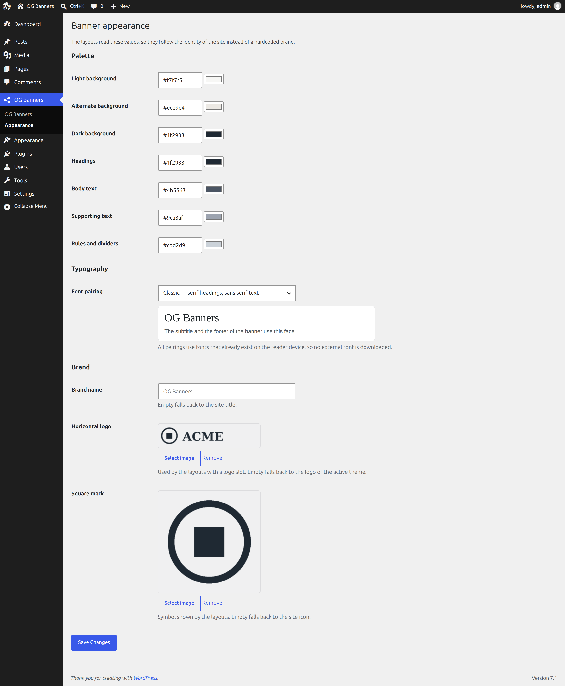
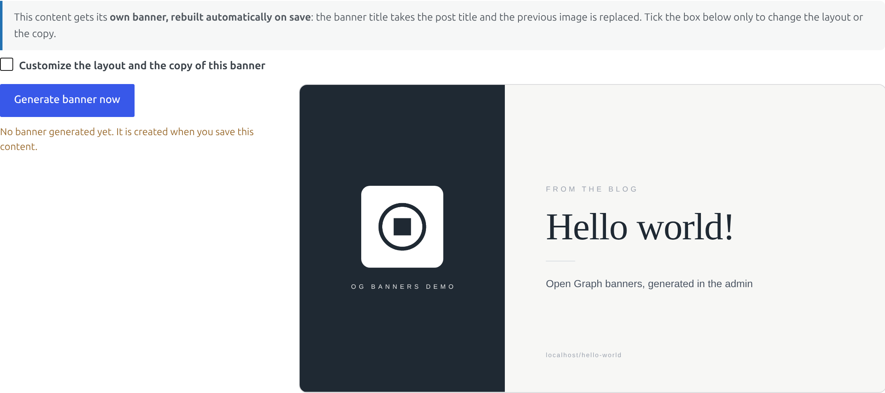
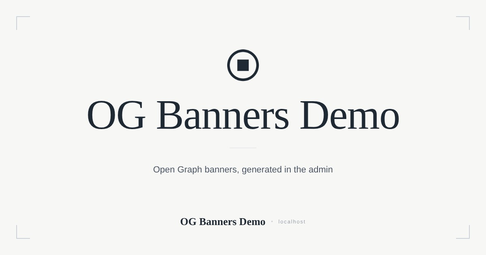
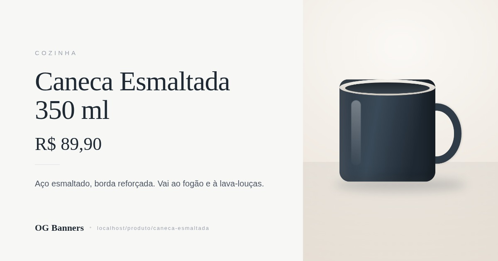

# Banners OG

[](https://github.com/jeffersonrucu/wp-banners-og/actions/workflows/ci.yml)
[](LICENSE)


Plugin WordPress que gera **banners Open Graph 1200 × 630** dentro do próprio admin
e publica a imagem como `og:image` do site — sem serviço externo, sem GD/Imagick.

O banner é montado em HTML/CSS, rasterizado no navegador com
[html2canvas](https://html2canvas.hertzen.com/) e enviado como upload multipart.
O PHP só valida e grava o arquivo.

O plugin não tem marca embutida: paleta, tipografia, logo e símbolo vêm das
configurações; layouts, campos e textos padrão são filtráveis; e um layout novo
pode ser registrado de fora, sem tocar no plugin.

Com **WooCommerce** ativo, cada produto ganha o próprio banner, com a foto, o
preço e a categoria do produto — veja [WooCommerce](#woocommerce). E quando um
plugin de SEO cuida das meta tags, o banner é entregue a ele em vez de ficar sem
uso — veja [Meta tags](#meta-tags).

**Banners OG** — um card por layout, com preview ao vivo e o arquivo em uso:



**Aparência** — paleta, par tipográfico e imagens da marca:



**Metabox** — cada post ganha o próprio banner, gerado ao salvar:



---

## Requisitos

- WordPress 5.9+
- PHP 7.4+
- Navegador moderno no admin (a geração acontece no cliente)

## Instalação

### Via Git

```bash
cd wp-content/plugins
git clone git@github.com:jeffersonrucu/wp-banners-og.git
```

### Via Composer (repositório VCS)

```json
{
    "repositories": [
        { "type": "vcs", "url": "git@github.com:jeffersonrucu/wp-banners-og.git" }
    ],
    "require": {
        "jeffersonrucu/banners-og": "^2.0"
    }
}
```

O `type` é `wordpress-plugin`; com `composer/installers` no projeto ele cai em
`wp-content/plugins/banners-og`.

Depois de ativar:

1. **Banners OG → Aparência**: paleta, font stacks, nome da marca, logo e símbolo.
2. **Banners OG**: revise os textos de cada layout e clique em *Generate and save banner*.
3. Posts e páginas passam a gerar o próprio banner ao salvar.

---

## Como funciona

| Camada | Papel |
| --- | --- |
| `Banners_OG_Plugin` | Bootstrap, chaves de storage, config do JS e enqueue dos assets. |
| `Banners_OG_Theme` | Paleta, tipografia e imagens da marca; imprime as CSS custom properties. |
| `Banners_OG_Templates` | Registro de layouts, campos, textos padrão e resolução de layout por contexto. |
| `Banners_OG_Admin` | Tela **Banners OG**: um card por layout. |
| `Banners_OG_Settings` | Tela **Aparência** (Settings API). |
| `Banners_OG_Metabox` | Metabox por conteúdo. |
| `Banners_OG_Ajax` | Recebe o upload, valida permissão e grava. |
| `Banners_OG_Storage` | `uploads/banners-og/`: grava via `wp_handle_upload()` e apaga o anterior. |
| `Banners_OG_Meta` | Meta tags `og:*` / `twitter:*` no `wp_head`. |
| `assets/js/banner.js` | Registro de layouts, preview ao vivo, captura e upload. |

### Fluxo por conteúdo

1. Todo post/página dos post types suportados ganha um banner **automático**:
   título do banner = título do post, resto = textos padrão do layout do tipo.
2. O checkbox *"Customize the layout and the copy of this banner"* libera os campos.
3. Ao **salvar** o post (Gutenberg ou editor clássico), o JS gera o banner e
   substitui o arquivo anterior — o botão *"Generate banner now"* faz o mesmo sob demanda.

### Armazenamento

Os banners **não** entram na biblioteca de mídia: ficam em
`wp-content/uploads/banners-og/`, com um `index.php` para bloquear autoindex. Cada
regeração apaga o arquivo antigo e usa um nome com timestamp
(`og-post-42-20260825120000.jpg`) para furar o cache das redes sociais.

Consequência: trocar de ambiente sem levar `uploads/` derruba os banners — é só regerar.

Como são arquivos e não attachments, um plugin de offload (S3, Spaces, GCS)
reescreve a URL de `uploads/` para o bucket mas nunca copia os banners para lá —
o bucket responderia `AccessDenied`. Quando a URL de uploads aponta para outro
host, o plugin serve o banner do próprio site
(`site.com/wp-content/uploads/banners-og/…`). Para servir de outro jeito, use o
filtro `banners_og_uploads_url`.

### Meta tags

`Banners_OG_Meta` se cala automaticamente se detectar Yoast, Rank Math, AIOSEO ou
SEOPress. Para forçar o comportamento, use o filtro `banners_og_output_tags`.

Calar não basta: sem as tags do plugin, o banner gerado não chegaria a lugar
nenhum. Por isso `Banners_OG_Seo` entrega a imagem para quem estiver imprimindo
as tags, pelos filtros públicos de cada plugin:

| Plugin | Filtros usados |
| --- | --- |
| Yoast SEO | `wpseo_opengraph_image`, `wpseo_twitter_image`, `wpseo_opengraph_image_width/height/type` |
| Rank Math | `rank_math/opengraph/facebook/image`, `rank_math/opengraph/twitter/image` |
| SEOPress | `seopress_social_og_thumb`, `seopress_social_twitter_card_thumb` |
| All in One SEO | `aioseo_facebook_tags`, `aioseo_twitter_tags` |

Duas ressalvas:

- No Yoast, os filtros só rodam quando ele **já escolheu** uma imagem. Post sem
  imagem destacada e sem fallback social continua sem `og:image`.
- O formato do array do AIOSEO não é contrato público, então a ponte só troca
  tags que já venham como string. Se a estrutura mudar, ela não faz nada — não
  quebra.

Para desligar a ponte e manter a escolha do plugin de SEO, use
`banners_og_seo_bridge`.

---

## Layouts que vêm no plugin

| Kind | Layout |
| --- | --- |
| `cover` | Centralizado em fundo claro, com símbolo, moldura e assinatura no rodapé. |
| `feature` | Fundo escuro, conteúdo à esquerda, símbolo em marca d'água. |
| `article` | Painel escuro à esquerda com símbolo e marca, conteúdo à direita. |
| `profile` | Centralizado em fundo alternativo, com logo horizontal. |
| `product` | Conteúdo à esquerda com preço, foto do produto à direita. Só com WooCommerce ativo. |

Exemplo do arquivo final, no layout `cover`:



Todos leem as mesmas custom properties, então seguem a paleta configurada:

```
--bog-bg  --bog-bg-alt  --bog-dark  --bog-accent  --bog-text  --bog-muted
--bog-rule  --bog-font-heading  --bog-font-body
```

Nenhum layout usa o logo como arte de fundo — símbolo repetido só funciona com
marca desenhada para isso, e aqui a marca é a que o site subiu. O detalhe
geométrico vem de `.bog-corner` (brackets de canto desenhados com a paleta).
Ainda assim, `--bog-mark-url` é exposta para quem quiser usar a marca como
`background-image` num layout próprio.

---

## WooCommerce

Com o WooCommerce ativo, `Banners_OG_Woocommerce` entra sozinho e acrescenta:

- o post type `product` na lista do metabox — cada produto ganha o próprio
  banner, regerado ao salvar, como qualquer post;
- o layout `product`: conteúdo à esquerda (categoria, nome, preço, resumo) e a
  foto do produto no painel à direita;
- os campos **Preço**, **Mostrar a foto no banner** (liga/desliga o painel) e
  **Foto** (media picker, vazio usa a imagem do produto), que só aparecem no
  layout `product`;
- o layout `product` como padrão do post type `product` e dos arquivos de
  `product_cat` / `product_tag`.

Exemplo do arquivo final, no layout `product`:



Os placeholders do metabox saem do próprio produto: categoria (primeiro termo de
`product_cat`), resumo (descrição curta, 24 palavras), preço
(`get_price_html()`, sem o preço riscado das promoções) e a imagem destacada.
Digitar qualquer campo sobrescreve; deixar vazio mantém o valor do produto.

O card **Product** na tela *Banners OG* segue valendo para os arquivos da loja,
onde não existe um produto específico.

Limitações conhecidas:

- **Preço desatualizado.** O banner é regerado quando o produto é salvo. Mudança
  de preço fora do editor (promoção agendada, edição em massa, importação) não
  dispara nova geração — o banner continua com o preço antigo até o próximo save.
  Para não correr o risco, apague o campo Preço no layout.
- **Foto em CDN.** Uma imagem de outro domínio contamina o canvas e a captura
  falharia. O plugin tenta primeiro o arquivo em `uploads/` — o que resolve
  otimizadores e offload, que só reescrevem a URL — e, se nem esse for do mesmo
  domínio, descarta a foto e o painel cai no símbolo da marca. Use
  `banners_og_product_image_url` para devolver uma URL same-origin.
- **Editor novo de produtos** (o experimental, em blocos) não renderiza metaboxes
  clássicos. O banner segue funcionando no editor padrão de produtos.
- **Catálogo existente** não é gerado em lote: hoje o banner nasce ao salvar o
  produto, um a um.

### Diagnóstico

**Banners OG › Diagnóstico** mostra onde os banners são gravados, qual URL eles
publicam e — no botão *Request the banner URLs now* — o status HTTP que essa URL
devolve de verdade. O relatório no fim da tela é texto puro, para colar num
issue. É por onde começar quando o `og:image` não abre.

---

## Extensão (nível dev)

### Filtros e actions

| Hook | Tipo | Default | Uso |
| --- | --- | --- | --- |
| `banners_og_post_types` | filtro | `['post', 'page']` | Onde o metabox aparece. |
| `banners_og_kinds` | filtro | 4 layouts | Adiciona/remove layouts (`kind => rótulo`). |
| `banners_og_fields` | filtro | eyebrow, title, sub, foot | Campos de texto dos layouts. |
| `banners_og_font_presets` | filtro | 4 pares tipográficos | Pares oferecidos na tela de Aparência. |
| `banners_og_template_defaults` | filtro | por layout | Textos padrão de um layout (`$defaults, $kind`). |
| `banners_og_default_kind_for_post_type` | filtro | mapa interno | Layout padrão de um post type. |
| `banners_og_default_kind_for_context` | filtro | por contexto | Layout usado em arquivos e listagens. |
| `banners_og_post_defaults` | filtro | defaults dos layouts | Placeholders de um post, derivados do conteúdo (`$defaults, $post`). |
| `banners_og_output_tags` | filtro | `true` (sem plugin de SEO) | Liga/desliga a saída das meta tags. |
| `banners_og_meta_data` | filtro | array montado | Ajusta título, descrição, URL, tipo e imagem. |
| `banners_og_seo_bridge` | filtro | `true` | Liga/desliga a entrega do banner ao plugin de SEO. |
| `banners_og_product_image_url` | filtro | foto do produto | Imagem usada pelo layout `product` (`$url, $product`). |
| `banners_og_uploads_url` | filtro | URL de `uploads/` | De onde os banners gerados são servidos. |
| `banners_og_enqueue_assets` | action | — | Enfileira CSS/JS de layouts próprios. |

### API JavaScript

Disponível em `window.BannersOG` depois que `banners-og-banner` carrega:

| Membro | Descrição |
| --- | --- |
| `registerTemplate(kind, renderer)` | Registra (ou substitui) o renderer de um layout. |
| `templates` | Mapa `kind => renderer`. |
| `helpers.esc(value)` | Escapa texto para HTML. |
| `helpers.image(url, className)` | Devolve `` — ou string vazia se não houver URL. |
| `boot()` | Reescaneia a página em busca de editores. |

O renderer recebe `(fields, ctx)` e devolve o HTML de **um** canvas 1200 × 630:

- `fields` — valores por chave de campo (`fields.title`, `fields.sub`, …).
- `ctx` — `{ esc, image, kind, brand, images: { logo, mark }, width, height }`.

`ctx.brand` é a marca da tela de Aparência, e serve de fallback do campo `brand`:
os layouts que assinam o banner imprimem `fields.brand || ctx.brand`.

### Criando um layout do zero

**1. Registre o layout, seus textos padrão e (se quiser) campos extras**

```php
add_filter( 'banners_og_kinds', function ( array $kinds ): array {
    $kinds['podcast'] = __( 'Podcast', 'meu-tema' );

    return $kinds;
} );

add_filter( 'banners_og_template_defaults', function ( array $defaults, string $kind ): array {
    if ( 'podcast' === $kind ) {
        $defaults['eyebrow'] = __( 'Episódio', 'meu-tema' );
        $defaults['sub']     = get_bloginfo( 'description' );
        $defaults['episode'] = '#01';
    }

    return $defaults;
}, 10, 2 );

add_filter( 'banners_og_fields', function ( array $fields ): array {
    $fields['episode'] = [
        'label'       => __( 'Número do episódio', 'meu-tema' ),
        'type'        => 'text',        // text | textarea | image | toggle
        'description' => '',
        'placeholder' => '#01',         // usado quando o layout não tem default
        'kinds'       => [ 'podcast' ], // vazio = aparece em todos os layouts
    ];

    return $fields;
} );
```

Os tipos:

| Tipo | Controle | Valor gravado |
| --- | --- | --- |
| `text` | input de texto | texto |
| `textarea` | textarea | texto com quebras |
| `image` | media picker, com preview | URL da imagem |
| `toggle` | checkbox | `1` ou string vazia |

`kinds` é o que evita poluir os outros layouts: o campo só aparece nos layouts
listados, e o formulário do metabox troca de campos junto com o select de
layout. Os textos padrão continuam vindo de `banners_og_template_defaults`.

**2. Enfileire o CSS e o JS do layout**

```php
add_action( 'banners_og_enqueue_assets', function (): void {
    $base = get_stylesheet_directory_uri() . '/og-podcast';

    wp_enqueue_style( 'og-podcast', $base . '/podcast.css', [ 'banners-og-admin' ], '1.0.0' );
    wp_enqueue_script( 'og-podcast', $base . '/podcast.js', [ 'banners-og-banner' ], '1.0.0', true );
} );
```

**3. Escreva o renderer**

```js
// podcast.js
window.BannersOG.registerTemplate('podcast', function (fields, ctx) {
  return '' +
    '<div class="bog-canvas bog-canvas--podcast">' +
      '<div class="bog-texture"></div>' +
      '<div class="pod-episode">' + ctx.esc(fields.episode) + '</div>' +
      ctx.image(ctx.images.mark, 'bog-mark') +
      '<div class="bog-eyebrow">' + ctx.esc(fields.eyebrow) + '</div>' +
      '<div class="bog-title">' + ctx.esc(fields.title) + '</div>' +
      '<div class="bog-sub">' + ctx.esc(fields.sub) + '</div>' +
      '<div class="bog-foot">' + ctx.esc(fields.foot) + '</div>' +
    '</div>';
});
```

**4. Estilize dentro de 1200 × 630, reaproveitando as custom properties**

```css
/* podcast.css */
.bog-canvas--podcast {
  display: flex;
  flex-direction: column;
  justify-content: center;
  padding: 90px;
  background: var(--bog-dark);
}

.bog-canvas--podcast .bog-title { font-size: 88px; color: #fff; }

.pod-episode {
  font: 600 14px/1 var(--bog-font-body);
  letter-spacing: .3em;
  color: var(--bog-muted);
}
```

Regras do renderer:

- Escape tudo que vem de `fields` com `ctx.esc()` — o HTML é injetado via `innerHTML`.
- Use `ctx.image()` para imagens: ele omite a tag quando não há URL configurada.
- O nó raiz precisa medir exatamente 1200 × 630; a captura rejeita outras medidas.
- Evite `filter`, `mask` e sombras exóticas: o html2canvas não renderiza tudo.
  Para logo em fundo escuro, prefira uma placa clara atrás da imagem (veja
  `.bog-mark-plate`) em vez de inverter a cor por CSS.

---

## Estrutura

```
banners-og/
├── banners-og.php                # header do plugin, requires e hooks
├── config.php                    # constantes
├── uninstall.php                 # limpeza de options, meta e arquivos
├── readme.txt                    # metadados do WordPress.org
├── includes/
│   ├── class-banners-og-plugin.php
│   ├── class-banners-og-theme.php
│   ├── class-banners-og-templates.php
│   ├── class-banners-og-storage.php
│   ├── class-banners-og-activator.php
│   ├── class-banners-og-admin.php
│   ├── class-banners-og-settings.php
│   ├── class-banners-og-status.php    # tela de diagnóstico
│   ├── class-banners-og-metabox.php
│   ├── class-banners-og-ajax.php
│   ├── class-banners-og-meta.php
│   ├── class-banners-og-seo.php       # entrega o banner ao plugin de SEO ativo
│   └── class-banners-og-woocommerce.php
├── assets/
│   ├── css/admin.css             # UI do admin + os 4 layouts
│   ├── css/woocommerce.css       # layout product
│   ├── js/banner.js              # registro de layouts, preview, captura, upload
│   ├── js/woocommerce.js         # renderer do layout product
│   ├── js/settings.js            # media picker e color inputs
│   └── vendor/html2canvas/       # 1.4.1 (MIT), versionado de propósito
├── bin/
│   ├── build-dist.sh             # monta dist/banners-og
│   └── check-version.php         # versão consistente entre header, config e readme
├── phpcs.xml.dist
└── phpstan.neon.dist
```

---

## Desenvolvimento

```bash
composer install
composer phpcs          # WordPress Coding Standards + PHPCompatibility
composer phpcbf         # corrige o que é automático
composer phpstan        # análise estática (nível 6)
composer check-version  # header × config.php × readme.txt
composer dist           # monta dist/banners-og
```

### plugin-check

O `bin/build-dist.sh` monta em `dist/banners-og` **só o que é plugin** — o
`.distignore` deixa fora tooling de desenvolvimento (`bin/`, `tests/`,
`composer.*`, configs de lint, `.github/`). É esse pacote que vai para o
WordPress.org e é nele que o
[Plugin Check](https://wordpress.org/plugins/plugin-check/) deve rodar:

```bash
composer dist
wp plugin check dist/banners-og
```

Rodar o checker direto no clone acusa `bin/` e `tests/` por não terem guarda de
acesso direto — são arquivos de CLI, que não fazem parte do pacote.

## Contribuindo

Veja [CONTRIBUTING.md](CONTRIBUTING.md). Vulnerabilidade: [SECURITY.md](SECURITY.md).

## Licença

GPL-2.0-or-later. `assets/vendor/html2canvas/` é de terceiros (html2canvas 1.4.1, MIT).
